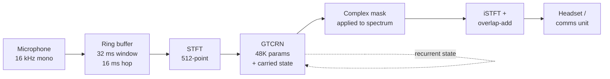

# Architecture & Team Guide

Start here if you're joining the project. Read §1–3 for what the system is, then jump
to whichever role section applies to you.

---

## 1. What we're building

A soldier speaks into a radio. The microphone also picks up engine drone, rotor wash,
gunfire and shelling. The listener has to understand the words. Our system sits between
the microphone and the transmitter and removes the noise computationally, in real time.

**Important framing:** the problem statement is titled *Active Noise Cancellation*, which
normally means emitting an opposite sound wave (like noise-cancelling headphones). But
the PS measures success with PESQ, STOI and SI-SNR — all measures of *transmitted speech
quality*, which cannot be computed on a sound field. So the core is **speech
enhancement** (clean the mic signal in software), plus the optional adaptive filter the
PS also describes. This is exactly what the PS goes on to specify.

---

## 2. Signal flow



**Why each stage exists:**

| Stage | Purpose |
|---|---|
| **STFT** | Converts audio into a time-frequency picture. Speech and noise look very different there, which is what makes separating them possible. |
| **GTCRN** | Predicts, for every frequency bin, how much to keep vs suppress. Works in the *complex* domain, so it fixes phase (timing) as well as level — this is what avoids the watery artefacts older methods produce. |
| **Carried state** | The model remembers context between frames. Critical: we process one 16 ms frame at a time, never re-running a buffer. |
| **iSTFT + overlap-add** | Rebuilds a continuous audio stream from the cleaned frames. |

**Causality:** the model only ever looks at past and present audio, never ahead. That's
what makes live conversation possible — measured algorithmic delay is **0 samples**.

---

## 3. Current status

| Metric | Value | Notes |
|---|---|---|
| End-to-end latency | **83.6 ms** | Measured acoustically. ITU-T G.114 says <150 ms is transparent |
| Real-time factor | **0.079** | Model uses 1.1 ms of every 16 ms — ~12× faster than needed |
| Benchmark PESQ / STOI | **2.855 / 0.941** | Reproduces published 2.87 / ~0.94 |
| Defence-noise PESQ | **2.33** | PS target is 2.5 — this gap is what fine-tuning targets |

**PS deliverables:** 4 of 5 built. Fine-tuning (training the model on defence audio) is
the remaining step; hardware deployment follows once a Raspberry Pi 5 arrives.

---

## 4. File map

### Core system — the real-time path

| File | What it does |
|---|---|
| `scripts/streaming_engine.py` | **The heart.** Frame-by-frame inference: ring buffer, STFT, ONNX model call with carried state, overlap-add. ~100 lines. |
| `scripts/live_demo.py` | The demo. `--check` (offline verify), `--measure-latency` (acoustic test), and live mic→speaker mode with an on/off toggle. |
| `third_party/gtcrn/` | Vendored upstream model (MIT licence). **Do not edit** — we treat it as a dependency. Contains the pretrained checkpoints and the pre-exported streaming ONNX model. |

### Evaluation — how we prove claims

| File | What it does |
|---|---|
| `scripts/run_baseline_eval.py` | Scores the model on the standard VCTK-DEMAND benchmark. This is our quality control: if it doesn't reproduce the published number, our measurement setup is broken. |
| `scripts/eval_impulsive_noise.py` | **The important one.** Mixes clean speech with real defence noise at controlled SNRs, scores PESQ/STOI/SI-SNR stratified by noise category, and reports statistical significance. |
| `scripts/spectral_subtraction.py` | The classical (pre-AI) baseline, so "we beat traditional DSP" is measured rather than asserted. |
| `scripts/verify_onnx_provenance.py` | Proves which checkpoint the demo actually runs. Caught a real mismatch between the demo and our reported numbers. |

### Data — noise handling

| File | What it does |
|---|---|
| `scripts/mad_noise.py` | Loads the Military Audio Dataset; groups the 7 classes into stationary / non-stationary / impulsive; excludes speech-contaminated clips. |
| `scripts/screen_noise_speech.py` | Runs a voice-activity detector over every noise clip to find ones that secretly contain speech. **Training on those would teach the model to delete voices.** |

### Training — the fine-tuning half

| File | What it does |
|---|---|
| `scripts/train_dataset.py` | **PS deliverable 1.** Generates noisy/clean training pairs on the fly: random SNR, impulsive events placed over voiced speech, augmentation (clipping, band-limiting, reverb). |
| `scripts/losses.py` | **PS deliverable 3.** The upstream loss plus our two contributions — multi-resolution STFT loss and asymmetric anti-over-suppression loss. |
| `scripts/finetune.py` | The training loop. Checkpoints every epoch (Colab disconnects), `--resume` restores optimizer state. |

---

## 5. Where to start, by role

**Presenting / non-technical:** `README.md` → this file §1–3. That's the whole story with
the numbers.

**Audio pipeline / demo:** `scripts/streaming_engine.py` first (it's short and it's the
core), then `scripts/live_demo.py`. Run `python scripts/live_demo.py --check` to see it
work without touching hardware.

**Training / model:** `scripts/train_dataset.py` → `scripts/losses.py` →
`scripts/finetune.py`, in that order. The docstrings explain *why* each design choice was
made, which matters more than the code.

**Evaluation / metrics:** `scripts/eval_impulsive_noise.py`, then the results tables in
`README.md`.

**Background reading:** `docs/solution-design.md` is the full build plan;
`docs/research-notes.md` has the literature survey and citations.

---

## 6. Key findings to know

These come up in judge questions — everyone on the team should know them.

**1. Classical DSP fails on impulsive noise.** Spectral subtraction improves engine noise
by +0.57 PESQ but gunfire by only **+0.07** — and at low SNR it makes things slightly
worse. It assumes noise is steady; a gunshot violates that. This empirically confirms the
claim the PS makes in its own background section.

**2. Impulsive brittleness is a training-data problem, not an architecture problem.** The
same model trained on a narrow corpus is 0.44 PESQ worse on gunfire; trained on a diverse
corpus, the gap vanishes. This is our original finding and it motivates the fine-tuning
stage.

**3. Some "gunfire" clips contain soldiers shouting.** We detected and removed 221 of
them. Training on them would have taught the model that voices are noise.

**4. Every number has error bars.** We run 100 trials per condition and report when a
difference is *not* statistically significant. An early 20-trial run produced a pattern
that turned out to be random noise — the tooling now prevents that mistake.

---

## 6a. Gotcha: two different checkpoints share one filename

Upstream ships **two different files both called `model_trained_on_dns3.tar`**:

| Path | Epoch | Used by |
|---|---|---|
| `third_party/gtcrn/checkpoints/` | 87 | All our reported metrics, and the fine-tuning starting point |
| `third_party/gtcrn/stream/onnx_models/` | 96 | `gtcrn_simple.onnx`, i.e. the current live demo |

Their weights genuinely differ (BatchNorm `running_var` by up to 138) — this is not a
serialization artifact. It was found when an otherwise-correct ONNX export appeared to
fail its verification.

**Why it doesn't invalidate anything:** the baseline metrics and the fine-tuning start
from the *same* file (epoch 87), so the before/after comparison is internally consistent.
Once we export ONNX from our own fine-tuned checkpoint, the demo and the metrics describe
one model again.

**What to watch:** if you load a checkpoint by filename alone, check which directory it
came from. `scripts/verify_onnx_provenance.py` exists to catch exactly this class of
mistake.

---

## 6b. Gotcha: the ONNX export must use opset 11

`torch >= 2.9`'s dynamo exporter **refuses opset 11 and silently upgrades to opset 18**,
emitting only a warning. The resulting model is numerically correct, so every accuracy
check still passes — but it carries ~30 extra graph nodes and benchmarks **3.5× slower**:

| Export | Opset | Nodes | ms/hop | RTF |
|---|---|---|---|---|
| Dynamo exporter (default) | 18 | 445 | 5.41 | 0.338 |
| Legacy exporter (`dynamo=False`) | 11 | 411 | 1.53 | 0.095 |

RTF 0.34 is fine on a laptop. On a Raspberry Pi — roughly 4–5× slower — it becomes ~1.4,
which **fails real-time**: the model can no longer keep up with incoming audio.

`scripts/export_onnx.py` passes `dynamo=False` for this reason. If you ever change the
export code, re-benchmark rather than trusting the correctness check alone; this failure
is invisible to accuracy tests and only shows up as dropouts on the target hardware.

---

## 7. Running things

```bash
python3 -m venv .venv && source .venv/bin/activate
pip install -r requirements.txt
```

| Command | Needs |
|---|---|
| `python scripts/live_demo.py --check` | Nothing — safe anywhere |
| `python scripts/live_demo.py` | Mic + **wired** headphones (Bluetooth adds 100–200 ms) |
| `python scripts/live_demo.py --measure-latency` | Speakers, not headphones |
| `python scripts/verify_onnx_provenance.py` | Nothing |
| `python scripts/mad_noise.py` | MAD dataset in `data/` |
| `python scripts/eval_impulsive_noise.py --with-classical` | MAD + VCTK-DEMAND |
| `python scripts/finetune.py` | LibriSpeech + MAD + a GPU |

**Datasets are not in the repo** (too large, and licensing forbids redistribution). See
`README.md` for download links. `data/` is gitignored.

---

## 8. Conventions

- `third_party/` is vendored and **never edited** — compatibility fixes go in our own code.
- Anything requiring a microphone is run by a human, never automated.
- No number goes in a slide without error bars or a significance check.
- Claims are stated at the strength the evidence supports — if a difference isn't
  significant, we say so.
